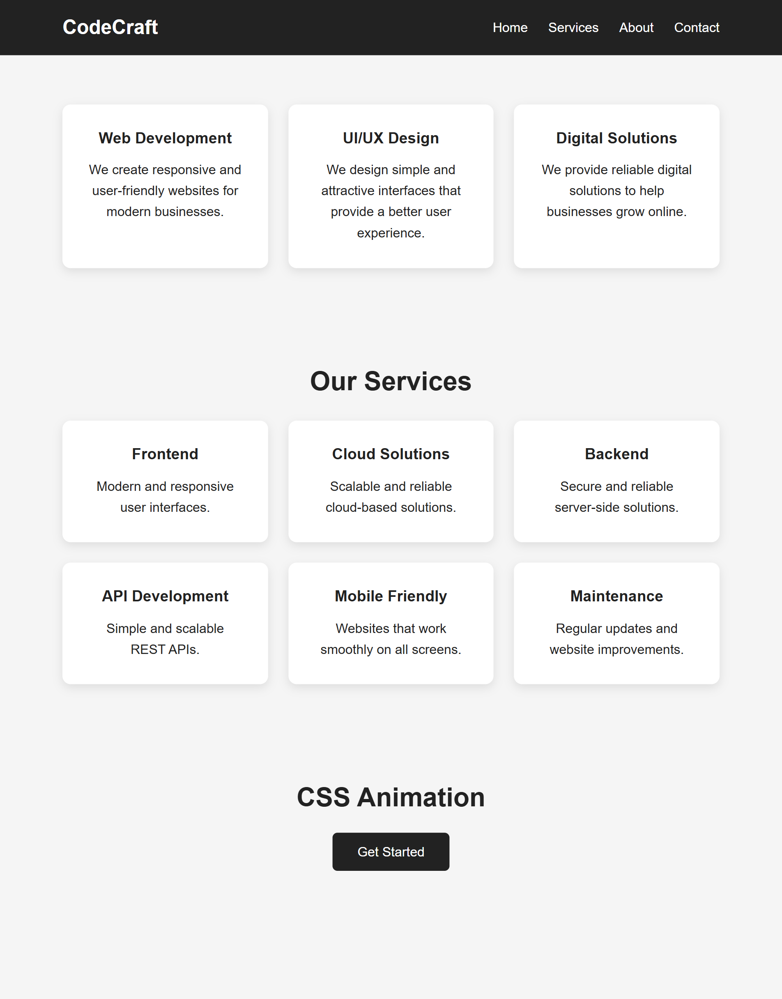
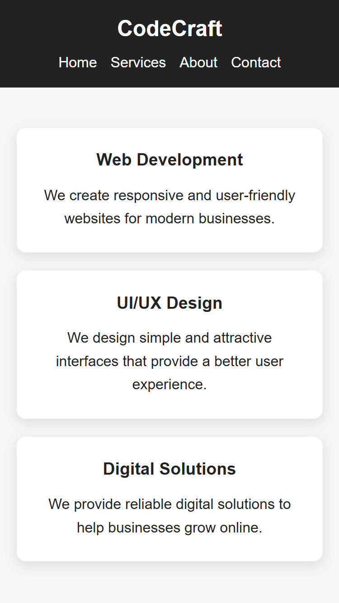
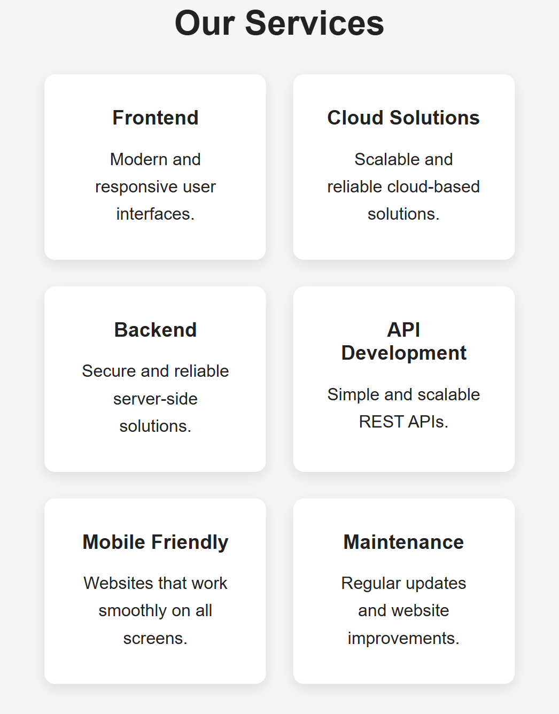

# CSS Challenge

This project is created as part of my Week 1 Web Development internship assignment.

The main purpose of this project is to practice CSS Flexbox, CSS Grid, responsive layouts, and basic CSS animations.

## Objective

The objective of this challenge was to understand how different CSS layout techniques work and how to make a webpage responsive for desktop and mobile devices.

## Technologies Used

* HTML5
* CSS3

## Features

### Flexbox Layout

* Created 3 feature cards using CSS Flexbox.
* Cards are displayed in a row on desktop screens.
* Cards stack vertically on smaller screens.
* Used `justify-content`, `align-items`, `gap`, and `flex`.
* Added hover effects to the cards.

### Grid Layout

* Created a service section using CSS Grid.
* Added 6 service cards.
* Used `repeat()` for defining grid columns.
* Added equal spacing between the cards.
* Made the grid responsive for smaller screens.

### CSS Animation

* Created a simple animated "Get Started" button.
* Added hover effects using CSS `transition` and `transform`.
* The animation is kept simple and smooth.

## Responsive Design

The project is designed to work on different screen sizes.

* Desktop: 3 cards in a row
* Tablet: 2 grid columns
* Mobile: Cards are displayed vertically

## Project Structure

```text
css-challenge/
│
├── index.html
├── style.css
├── screenshots/
│   ├── flex-desktop.png
│   ├── flex-mobile.png
│   ├── grid-layout.png
│   └── animation-demo.png
│
└── README.md
```

## Screenshots

### Flexbox - Desktop



### Flexbox - Mobile



### Grid Layout



### CSS Animation


## How to Run

1. Download or clone this repository.
2. Open the project folder in VS Code.
3. Open `index.html` in a browser.

No additional installation is required.

## Live Project

Live Demo: Add your deployed project link here.

## What I Learned

While working on this project, I practiced creating layouts using Flexbox and Grid. I also learned how to make layouts responsive using media queries and how to add simple hover animations using CSS.

## Author

**Sachin Rajput**

B.Tech - Computer Science

GitHub: Sachinchouhan09
